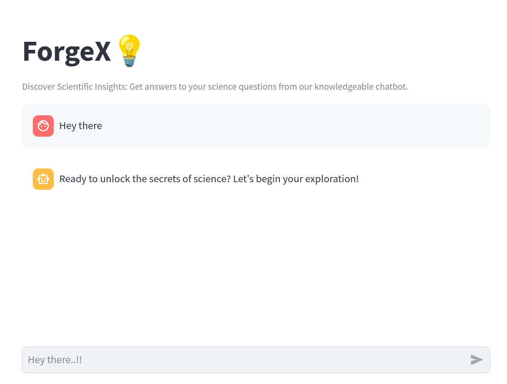

# ForgeX - Science and Technology Chatbot

ForgeX is a chatbot trained on the SciQ dataset, a collection of scientific questions and answers available on Kaggle. It is designed to provide answers to queries related to science and technology. Additionally, ForgeX includes features for greetings, goodbyes, and other common interactions to make the chatbot more user-friendly.

## Features

- Answers queries related to science and technology.
- Includes greetings, goodbyes, and other common interactions.
- Trained on the Sentence Transformer model paraphrase-distilroberta-base-v1.
- Can be further trained on custom datasets by modifying the `data_preprocessing.py` and `Datasets` folder.

## Usage

To run the chatbot, follow these steps:

1. Clone the repository from GitHub.
2. Make sure you have poetry install in your machine.
3. Install packages using poetry `poetry install`
4. Alternative if you have virtualenv then install dependencies using `requirements.txt` using command `pip install -r requirements.txt`.
5. Modify the data preprocessing and datasets as needed.
6. run the start script to start openfabric server 'sh start.sh`
7. Go to the `http://localhost:5500` and go Swagger UI.
8. Go to `execute` API endpoint. Add the queries that you want to ask to the chatbot as list of string.
9. Click on **execute**. You will get the answer.
10. Alternative you can run my Streamlit chat app using `streamlit run chatbot.py`.
    
- The Python SDK documentation for OpenFabric is available at [https://docs.openfabric.ai/developer-tools/python-sdk/index](https://docs.openfabric.ai/developer-tools/python-sdk/index).

## Demo

A demo of the project and its execution is available in the following video:

[Demo Video Link](LinK)
